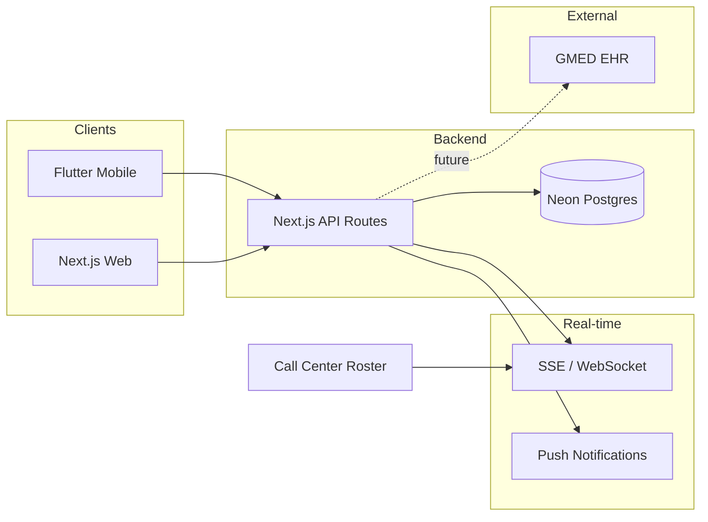

# Physician Scheduling Platform — Web, Mobile & Backend Plan

## Current state

- **Workspace:** Greenfield ([README.md](c:\Users\meera\Documents\Development\DrKhalid\README.md) only).
- **Backend:** Neon MCP available (connection string, migrations, optional Neon Auth + Data API).
- **GMED:** No public API docs found; plan assumes FHIR/HL7 or vendor API when available.

---

## 1. Architecture overview

- **Single backend:** Next.js API routes (or a small Node service) as the only backend; both web and mobile call it.
- **Database:** Neon PostgreSQL (connection string from Neon MCP; use `prepare_database_migration` / `complete_database_migration` for schema).
- **Auth:** Neon Auth (Better Auth–compatible) or another provider (Clerk/Auth0) with JWT; same identity for web and mobile.
- **Real-time:** SSE or WebSocket for live roster and in-app alerts; push (e.g. Firebase) for mobile “open shift” / “swap” alerts.

---

## 2. Neon backend (PostgreSQL)

### 2.1 Core schema (high level)

- **Users & roles:** `users` (from Neon Auth or your own), `profiles` (role: admin | physician), link to physicians.
- **Physicians:** `physicians` (user_id, name, contact, specialties, constraints for AI).
- **Schedules & shifts:** `schedules` (e.g. month/week scope, status), `shifts` (schedule_id, physician_id, start/end, type e.g. call/clinic, location).
- **Open shifts & pickups:** `open_shift_requests` (shift_id, dropped_by_physician_id, status: open | claimed | approved | rejected), `shift_pickup_requests` (open_shift_request_id, requested_by_physician_id, status, approved_by_admin_id).
- **Swaps:** `shift_swap_requests` (shift_a_id, shift_b_id, physician_a_id, physician_b_id, status, admin_approved_at, admin_id).
- **Audit / roster:** `roster_events` or `schedule_audit_log` (event_type: drop, pickup, swap, approve; who, when, payload) for live roster and call-center view.
- **AI scheduling:** `schedule_templates` or `scheduling_rules` (parameters: min/max shifts per physician, fairness, blackout dates); generated drafts stored as `schedules` with status `draft` until admin publishes.

Use **constraints and indexes:** unique (schedule_id, start_time, physician_id) to avoid double-booking; indexes on (schedule_id, start_time), (physician_id, start_time) for conflict checks and roster queries.

### 2.2 Conflict checking (in API layer)

- **On drop:** Ensure shift is still assigned to dropper; mark open (no conflict).
- **On pickup:** Query `shifts` for the requesting physician in the same time range; if any overlap, reject with “Conflict: you have another shift at that time.”
- **On swap:** Check both physicians: A has no other shift during B’s shift, B has no other shift during A’s shift; otherwise reject.
- **On admin bulk apply (AI draft):** Before committing, run conflict check per physician (no overlapping shifts); rollback or surface errors.

Implement as server-side functions called from Next.js API (e.g. “validate pickup”, “validate swap”, “validate schedule draft”).

### 2.3 Auth and API access

- Use **Neon Auth** (provision via MCP `provision_neon_auth`) for branch-compatible users/sessions, or keep auth in app and use Neon only for DB.
- Optional: **Neon Data API** (`provision_neon_data_api`) for serverless HTTP access with JWT; if you prefer, use a single Neon connection string from Next.js API only and skip Data API.

---

## 3. Next.js web application

- **Stack:** Next.js 14+ (App Router), React, TypeScript. Use Neon server driver (`@neondatabase/serverless` or `pg` with connection string from env).
- **Auth:** Sign-in/sign-up with role (admin vs physician); protect routes by role (e.g. `/admin/`*, `/physician/`*).
- **Admin:**  
  - Enter/edit physician schedules (calendar UI: create/edit/delete shifts).  
  - View and approve **open shifts** (list of pickup requests; approve/reject).  
  - View and approve **swap requests** (approve/reject; optionally “notify call center”).  
  - **AI schedule generation:** Form for parameters (e.g. date range, rules from `schedule_templates`), trigger generation (see §5), then show draft calendar for tweaking (drag/drop, add/remove shifts) and “Publish” to make live.
- **Physician:**  
  - View own schedule.  
  - **Drop shift:** Button per shift → create open shift request → notify eligible physicians (or “all”).  
  - **Pick up open shift:** List of open shifts → request pickup → “Pending admin approval.”  
  - **Swap:** Propose swap with another physician (select own shift + their shift) → submit → “Pending admin approval”; admin approval triggers “notify call center” and roster update.
- **Call center (read-only) live roster:** Dedicated page or embed that subscribes to real-time feed (SSE/WebSocket) of “who is on call when” and recent changes (drops, pickups, swaps). No edit rights.
- **Notifications (web):** In-app list (e.g. “New open shift”, “Your pickup approved/rejected”, “Swap request from X”); optional email. Real-time via same SSE/WS as roster if on web.

---

## 4. Flutter mobile app

- **Stack:** Flutter (Dart), shared API base URL and JWT (store token securely).
- **Screens:** Login; schedule view (calendar/list); “Open shifts” list; “Request pickup”; “Drop shift” (confirm); “Request swap” (pick shift + counterparty); notifications list; optional “Call center roster” (read-only).
- **Push notifications:** Firebase Cloud Messaging (or similar) for: new open shift, pickup approved/rejected, swap requested/approved/rejected. Backend: on status change, call FCM to target user(s).
- **Conflict handling:** All conflict checks on server; app shows server error (e.g. “Conflict: you have another shift at that time”) and does not allow resubmit until user changes selection.
- **Offline:** Optional: cache “my schedule” and open shifts for read-only view; mutations always online with retry.

---

## 5. AI-generated schedules

- **Input (admin-defined parameters):** Date range, list of physicians, rules (e.g. max shifts per week, no back-to-back nights, blackout dates from `physicians` or from a simple table), shift types/slots (e.g. “weekday call”, “weekend call”).
- **Implementation options:**  
  - **Rule-based first:** Distribute shifts in round-robin or by weight, respecting blackouts and max shifts; output set of `shifts` rows as `draft`.  
  - **LLM-assisted:** Send same parameters + “generate a fair schedule” to an LLM API; parse structured output (e.g. JSON list of shifts) into `shifts` draft.
- **Flow:** Admin clicks “Generate schedule” → backend creates draft schedule and shifts → admin sees calendar, tweaks (API: add/delete/move shifts), then “Publish” (draft → live; optionally notify physicians). Conflict check runs on publish (and ideally after each tweak).

---

## 6. Notifications and alerts

- **Open shift dropped:** Notify “all physicians” or “eligible pool” (e.g. same specialty/location) via in-app and push (mobile); email optional.
- **Pickup requested:** Notify admins (in-app + email).
- **Pickup approved/rejected:** Notify requesting physician (in-app + push).
- **Swap requested:** Notify other physician and admins; on approval, notify both physicians and “call center” (e.g. roster event).
- **Delivery:** Store events in DB (e.g. `notifications` table); Next.js API sends FCM for push; web uses SSE or polling for in-app list.

---

## 7. Live roster for call center

- **Data:** Current “on call” view: from `shifts` (and approved swaps) for “now” and next N hours/days; plus recent `roster_events` (drops, pickups, swaps).
- **Real-time:** SSE or WebSocket endpoint; on any shift/swap/approval change, broadcast roster snapshot or delta to subscribed clients. Call center page (and optional Flutter screen) subscribe and re-render.
- **Read-only:** No auth for call center if internal-only, or read-only role/token; only `GET` roster and stream.

---

## 8. GMED EHR integration (future)

- **Goal:** Sync relevant schedule/call data so GMED (or call center tools) can show who is on call.
- **Approach:**  
  - Prefer **GMED-supplied API** (FHIR R4 Schedule/Practitioner or custom). Implement adapter in Next.js: on roster publish or swap approval, call GMED API to update schedule/on-call list.  
  - If only HL7 v2/v3: Use an integration engine (e.g. Mirth) or vendor; Next.js sends HL7 messages to that engine.
- **Scope for v1:** Placeholder “GMED sync” config (e.g. API URL, credentials) and one “Send to GMED” button or webhook on “Publish schedule” / “Approve swap”; implement actual GMED calls once vendor docs are available.

---

## 9. Repo and project layout (recommended)

- **Monorepo** (e.g. `apps/web`, `apps/mobile`, `packages/api-types` or shared types in `apps/web` and consumed by Flutter via OpenAPI/fetch):
  - `apps/web` — Next.js (API routes + React).
  - `apps/mobile` — Flutter.
  - `packages/db` or `apps/web/db` — Neon migrations (SQL), shared types for shifts/physicians (or generate from OpenAPI).
- **Env:** `DATABASE_URL` (Neon connection string), `NEXTAUTH_`* or Neon Auth URL, `FCM_`* for push, optional `OPENAI_*` or similar for AI scheduling.

---

## 10. Implementation order (suggested)

1. **Neon:** Create project/branch, run initial migrations (users/profiles, physicians, schedules, shifts, open_shift_requests, shift_pickup_requests, shift_swap_requests, roster_events, schedule_templates).
2. **Auth:** Neon Auth (or alternative) and role-based redirect (admin vs physician).
3. **Next.js API:** CRUD for physicians, schedules, shifts; endpoints for “drop shift”, “list open shifts”, “request pickup”, “request swap”; conflict checks in API.
4. **Admin approval APIs:** Approve/reject pickup and swap; on approval, update shifts and write roster_events.
5. **Next.js web UI:** Admin calendar (create/edit shifts), physician calendar, open-shift list, pickup/swap flows, admin approval screens.
6. **Notifications:** DB + in-app list; then FCM and backend trigger for mobile push.
7. **Live roster:** SSE/WebSocket + “current on call” query; call center page.
8. **Flutter app:** Same flows (schedule, drop, pickup, swap, notifications, roster) against existing API.
9. **AI scheduling:** Parameter form + rule-based (or LLM) generator + draft calendar + publish with conflict check.
10. **GMED:** Config and stub “sync” hook; implement when API known.

---

## 11. Risks and mitigations

- **GMED unknown:** Design a small “roster export” or webhook interface so GMED integration can be swapped in later without changing core schema.
- **Real-time scale:** Start with SSE; move to WebSocket or a managed service (e.g. Ably) if many concurrent call-center clients.
- **AI quality:** Start with rule-based scheduling; add LLM only for “suggestions” and keep admin in the loop for all publishes.

This plan gives you a single backend (Neon + Next.js API), clear roles (admin vs physician vs call center), conflict-safe drop/pickup/swap with admin approval, live roster, and a path to AI-generated schedules and GMED integration without blocking initial delivery.